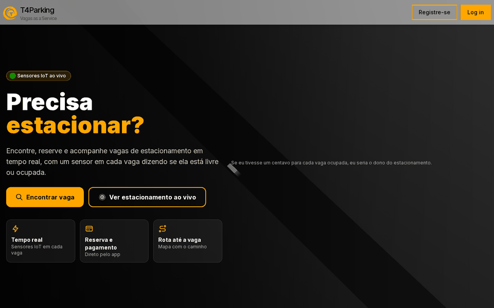

<p align="center">
  
</p>

<h1 align="center">
  Tech4Parking · Front
</h1>

<p align="center">
  
</p>

<p align="center">
  <a href="https://skillicons.dev">
    
  </a>
</p>

## Qual a finalidade do projeto?

Web app do **VagasAService**, a plataforma do **Tech4Parking** para encontrar, reservar e cadastrar vagas de estacionamento. O usuário vê as vagas no mapa, traça a rota até elas, reserva e paga pelo próprio navegador.

A disponibilidade de cada vaga vem de sensores reais: um **ESP32** instalado na vaga publica no **AWS IoT Core** se ela está ocupada ou livre, e a **Lambda** do projeto grava esse estado no **DynamoDB**. O front consome esses dados pela **API Gateway**.

Em produção, o site roda no **ECS Fargate** atrás de um **Application Load Balancer**, com domínio no **Route 53** e HTTPS pelo **ACM**.

## Arquitetura

<p align="center">
  
</p>

## O que foi construído

### Páginas

| Rota | Descrição |
|---|---|
| `/` | Página inicial |
| `/search` | Busca de vagas no mapa, com rota até a vaga |
| `/list-spots` | Lista das vagas e da disponibilidade de cada uma |
| `/parking` | **Estacionamento ao vivo em 3D**: carros entram e saem conforme os sensores, com totais de vagas livres e ocupadas |
| `/register-spot` | Cadastro de uma nova vaga (nome, latitude, longitude) |
| `/login`, `/register` | Autenticação |
| `/api/health` | Health check da aplicação |

### Integrações

| Integração | Uso |
|---|---|
| API Gateway (`/spots`) | Listar e cadastrar vagas ([tech4parking-back](https://github.com/willtechdev/tech4parking-back)) |
| Mapbox | Mapa, geocodificação e rotas |
| Stripe | Pagamento da reserva |
| NextAuth + Google | Login |
| Cloudinary | Upload de imagens |
| Apollo Client | Consultas GraphQL |

## Tecnologias utilizadas

- **Next.js 14 + React:** framework web com renderização no servidor;
- **TypeScript:** tipagem de todo o código;
- **Tailwind CSS:** estilização;
- **Three.js + React Three Fiber:** cenas 3D da home e do estacionamento ao vivo;
- **Mapbox:** mapas e rotas;
- **Stripe:** pagamentos;
- **NextAuth:** autenticação com Google;
- **Apollo Client:** cliente GraphQL;
- **Docker:** imagem de produção (Node 20, build em duas etapas);
- **AWS ECS Fargate + ALB:** execução do site em produção.

## Estrutura do repositório

```text
tech4parking-front/
├── apps/web/
│   ├── src/app/                 # Páginas (App Router), incluindo /parking
│   ├── src/components/3d/       # Cenas 3D (home e estacionamento ao vivo)
│   ├── src/components/          # Componentes (atoms, organisms, templates)
│   ├── .env.example             # Variáveis de ambiente necessárias
│   └── Dockerfile               # Imagem de produção
├── docs/
│   ├── demo.gif                 # Demonstração do app
│   ├── logo.png                 # Logo T4Parking
│   └── arch.gif                 # Diagrama da arquitetura
├── docker-compose.yml           # Sobe o site em modo produção
└── README.md
```

## Fluxo de funcionamento

1. O usuário acessa `vagasaservice.com.br`, resolvido pelo Route 53 com certificado do ACM.
2. O Application Load Balancer encaminha para o site Next.js no ECS Fargate.
3. No navegador, o site chama `GET /spots` na API Gateway para listar as vagas.
4. A API Gateway invoca a Lambda `process_car_parking`, que lê a tabela `ParkingSpots` no DynamoDB.
5. Em paralelo, o sensor da vaga publica mudanças de ocupação no AWS IoT Core, e a Lambda atualiza a tabela.
6. O site mostra cada vaga como **disponível** ou **ocupada**, com mapa, rota e reserva.
7. Em `/parking`, o estacionamento 3D consulta `/spots` a cada 3 segundos e anima a entrada e a saída dos carros.

## Como rodar

Copie `apps/web/.env.example` e preencha as chaves (Mapbox, Stripe, Google, Cloudinary e as URLs das APIs):

- `.env.local` dentro de `apps/web` para desenvolvimento
- `.env` na raiz para o Docker

**Docker (produção):**

```bash
docker compose up -d --build
# http://localhost:3000
```

**Desenvolvimento:**

```bash
cd apps/web
npm install
npm run dev
```

Sem as chaves as telas abrem, mas mapa, login, pagamento, upload e dados das vagas não funcionam.

## Como validar a entrega

Em uma validação end-to-end, o site deve abrir pelo domínio, listar as vagas vindas da API e refletir na tela a mudança feita pelo sensor.

Pontos principais de validação:

- `GET /api/health` respondendo `200`;
- páginas `/`, `/search`, `/list-spots`, `/parking`, `/register-spot`, `/login` e `/register` carregando;
- `/parking` mostrando as vagas em 3D e atualizando os carros quando a disponibilidade muda;
- `/list-spots` exibindo as vagas retornadas por `GET /spots`;
- cadastro em `/register-spot` criando a vaga via `POST /spots`;
- mapa e rotas funcionando com o token do Mapbox;
- imagem Docker de produção subindo com `docker compose up -d --build`.

## Projeto Tech4Parking

| Repositório | Camada |
|---|---|
| **tech4parking-front** | Web app (Next.js) |
| [tech4parking-back](https://github.com/willtechdev/tech4parking-back) | Lambda de vagas (sensor + API) |
| [tech4parking-infra](https://github.com/willtechdev/tech4parking-infra) | Infraestrutura AWS (Terraform) |
| [tech4parking-iot](https://github.com/willtechdev/tech4parking-iot) | Firmware do sensor (ESP32) |

## Autor

**William Alves Coelho** · [@willtechdev](https://github.com/willtechdev)
